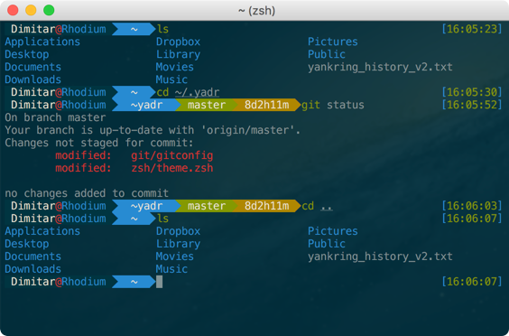
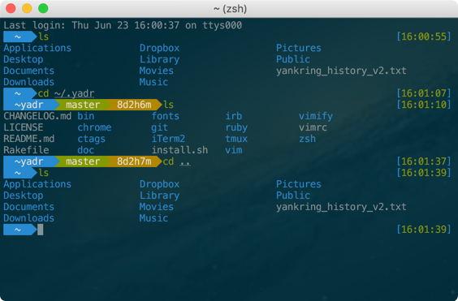

# Radium - A ZSH Prezto theme

I recently started using ZSH and Prezto, and I wanted to hack a theme to my liking
as well as learn a little more about ZSH. There are many great themes out there
and in fact I have based my theme on several of them. Feel free to use or abuse
this as you see fit.

## Prompt design
- Designed for dark terminals
- Single line prompt
- User@hostname on the left + on/off toggle through an env var
- Git branch info on the left
- Time since last Git commit on the left
- Time of execution on the right
- Dynamic prompt blocks

##### Radium with enabled user block
> I call the user@hostname the "user" block.

##### Radium with disabled user block
> This looks similar to the agnostic theme which I also enjoyed.

## Installation

I am a big fan of [skwp/dotfiles](https://github.com/skwp/dotfiles) and radium was created to work with it.

The installation instruction are a guidance, not a prescription.

### Installation along with skwp/dotfiles
You can clone the skwp/dotfiles repo and add the theme in *zsh/prezto/modules/prompt/functions*. However, if you just want to play with it in your current installation, the following instructions are much less intrusive.

  1. Install [skwp/dotfiles](https://github.com/skwp/dotfiles#installation)
  2. Clone the repository:

        git clone --recursive https://github.com/dimitardimitrov/radium.git ~/.themes/radium

  3. Make the theme available to ZSH:

        ln -s ~/.themes/prompt_radium_setup ~/.zsh.prompts/prompt_radium_setup

  4. Enable the theme:

        echo "prompt radium" > ~/.zsh.after/prompt.zsh

If the file exist, simply open it in an editor and add:

        prompt radium

### Installation with Prezto
  1. Install [Prezto](https://github.com/sorin-ionescu/prezto)
  2. Clone the repository:

        git clone --recursive https://github.com/dimitardimitrov/radium.git ~/.themes/radium

  3. Link the radium theme file into the Prezto's theme folder:

        ln -s ~/.themes/prompt_radium_setup [your_path]/prezto/modules/prompt/functions/prompt_radium_setup

  4. Load the theme by adding it to ~/.zpreztorc as mentioned in the [Prezto docs](https://github.com/sorin-ionescu/prezto)

## Configuration
There isn't much to configure. The only option is to remove the user block from the left side of the prompt. This is convenient when your prompt gets crowded. You can enable/disable the user block through the RADIUM_USER_BLOCK environemntal variable. 

#### Disable the user block
  1. Add the user block variable with 0 value(false) to your environment variables. 
  
        RODIUM_USER_BLOCK=0" >> ~/.zprofile

#### Enable the user block
  1. Edit your environment variable file for ZSH
  2. Change the value of RODIUM_USER_BLOCK variable to 1 or remove the variable completely:

        RODIUM_USER_BLOCK=1

## Remove the radium theme
1. Disable the theme by removing it from:
        ~/.zsh.after/prompt.zsh - for skwp/dotfiles
        ~/.zpreztorc - for Prezto only installation
2. Delete the ~/.themes folder or just the radium theme from it if you have stored other themes there.
